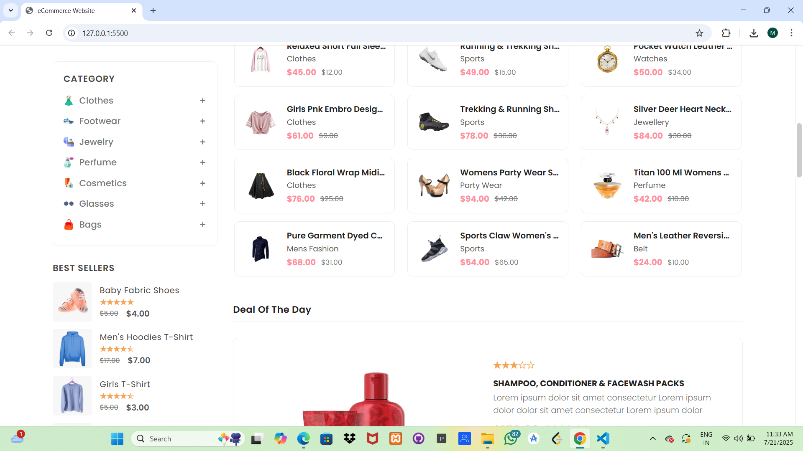

# 🛒 eCommerce Website

A simple and responsive eCommerce website built using **HTML**, **CSS**, and **JavaScript**. This project showcases a frontend UI for a shopping website with a product grid, navigation bar, and basic interactions.

## 🚀 Features

- Responsive design for all screen sizes
- Product grid layout with images and pricing
- Navigation bar
- Stylish modern UI
- Clean folder structure

## 🖼️ Preview




## 📁 Project Structure

```

ecommerce-website/
├── index.html
├── assets/
│   ├── css/
│   │   └── style-prefix.css
    |   |__ style.css
│   ├── images/
│   │   └── \[product images, logo, etc.]
│   └── js/
│       └── script.js
├── README.md

````

## 🛠️ Technologies Used

- HTML5
- CSS3
- JavaScript 

## 🧰 How to Use

1. Clone the repository:
   ```bash
   git clone https://github.com/your-username/ecommerce-website.git
````

2. Open the project folder:

   ```bash
   cd ecommerce-website
   ```
3. Open `index.html` in your browser.

## 🧾 License

This project is licensed under the MIT License.

---

## 👨‍💻 Author

* **Your Name** – [Miru1110](https://github.com/Miru1110)

---
